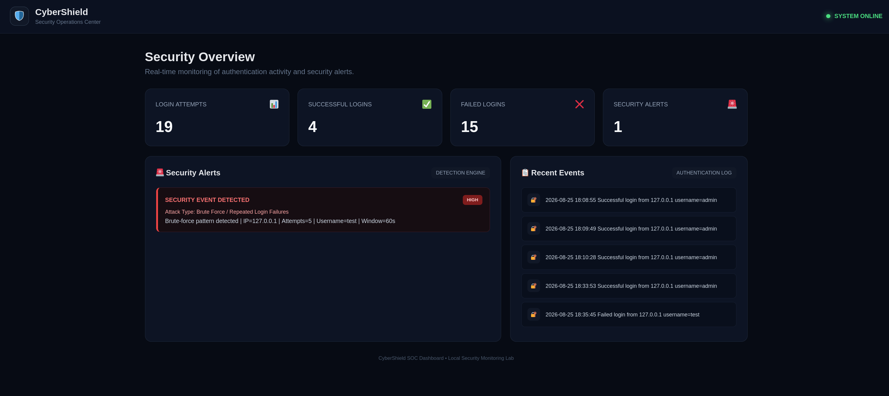

# CyberShield 🛡️

## Local Security Monitoring & Brute-Force Detection Lab

CyberShield is a local cybersecurity lab project that demonstrates a simple security monitoring workflow.

The project records login activity, detects repeated failed login attempts, generates security alerts, and displays the results through a web-based dashboard.

---

## Project Workflow

```text
Web Application
       ↓
Authentication Logs
       ↓
Detection Engine
       ↓
Security Alerts
       ↓
SOC Dashboard

Features

* 🔐 Login authentication
* 📝 Authentication logging
* 🚨 Brute-force detection
* ⚠️ Security alert generation
* 📊 Security monitoring dashboard
* 🔎 Network and web security testing

⸻

Tools & Technologies

* Python
* Flask
* HTML
* CSS
* Kali Linux
* Nmap
* Burp Suite Community Edition
* Wireshark

⸻

Security Testing

Nmap

Used for network and service discovery.

Report:

reports/nmap_scan.txt

Burp Suite

Used to inspect the web application’s login request.

Report:

reports/burp/login-request.txt

Wireshark

Used to observe network traffic generated by the local application.

Screenshot:

screenshots/wireshark-cybershield.png

⸻

Detection Test

Repeated failed login attempts were generated to test the detection mechanism.

The system successfully recorded the failed attempts and generated a security alert.

The alert was stored in:

logs/alerts.log

⸻

Dashboard

The CyberShield dashboard displays:

* Total login attempts
* Successful logins
* Failed logins
* Security alerts
* Recent authentication events
* Detected security events

Final test results:
Login Attempts:     19
Successful Logins:   4
Failed Logins:      15
Security Alerts:     1

Project Structure
cyber-lab/
├── web-app/
│   ├── app.py
│   └── templates/
│       └── login.html
├── detection/
│   └── detector.py
├── dashboard/
│   ├── app.py
│   └── templates/
│       └── dashboard.html
├── logs/
│   ├── login.log
│   └── alerts.log
├── reports/
│   ├── nmap_scan.txt
│   └── burp/
│       └── login-request.txt
└── screenshots/

Scope

CyberShield is an educational local cybersecurity lab designed for testing security monitoring and detection concepts in a controlled environment.

It is not intended to be a production-grade SIEM.

Author

Asayel Gasim 

Cybersecurity Diploma Graduate
